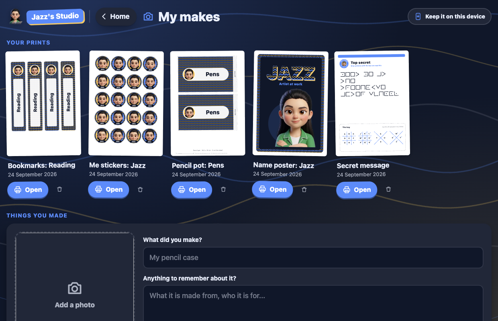

<div align="center">


# Jazz's Studio

**Design it, print it, make it yours.**

**[sukhiplay.com/studio](https://sukhiplay.com/studio/)** &nbsp;&middot;&nbsp;
**[Open the studio](https://sukhiplay.com/playground/studio/)**

[](LICENSE)
[](https://sukhiplay.com/)
[](https://sukhiplay.com/playground/)


</div>

---

A studio for Jazz, who is ten, loves stationery, and turns the recycling into
things. Her brother got [Sukhi Play](https://sukhiplay.com/) and she wanted
something of her own, so this is hers: her character, her colours, her name on
everything, and a printer at the end of it.

Dark by default and nothing girly, because that is what she asked for.

## Try it

| | |
| --- | --- |
| **In a browser** | [sukhiplay.com/playground/studio/](https://sukhiplay.com/playground/studio/) |
| **On a phone or tablet** | Open it, then Add to Home Screen. It opens full screen and keeps working with no signal. |
| **Inside Sukhi Play** | It ships in the download, with no internet needed at all. |

## What she can make

| | |
| --- | --- |
| **Stationery** | Five groups: stickers (of her character, or in her pattern), a diary (cover and pages), labels and gift tags, planners and to-do lists, bookmarks and door signs |
| **Make from a box** | Measure a toilet roll, a cereal box or a lid, and print a wrap that fits it, with the steps to make a pencil pot, a desk tidy, a notebook cover or a treasure box |
| **My brand** | Her own logo in four styles, business cards and logo stickers. The logo goes on her diary cover too |
| **Play** | A poster of her name, secret messages in pigpen with a key for a friend, story sparks for when the diary page is blank, a doodle pad, and invite cards with a code a friend's camera opens the studio from |
| **My makes** | Her prints, kept to print again or change first, and photos of everything she made, all on the device |
| **Make it yours** | Her character, or a family's own (see below), her name, seven letterings, twelve colour sets and any colour besides, her favourite pattern and the background |

The colours are on a strip above the preview in every tool, so a colour is
tried where it shows rather than in another room. Each sheet keeps its own, so
trying a colour on a bookmark changes the bookmark and nothing else.

After a print the studio asks whether to keep it in My makes, and what to call
it. It keeps the settings rather than a picture: open it later and the tool is
back exactly as it was, ready to print again or to change a word first.

<div align="center">




</div>

## Printing

Every sheet is drawn in millimetres on A4, and prints on one page, on a
computer, a tablet or a phone. Print wraps at **actual size** (100%, not
"fit to page"), so a wrap for a toilet roll comes out the right size to go
round one; each wrap carries a line that should measure exactly 5 cm, so a
ruler can check. Nothing is closer than 10 mm to the edge. An iPad always
prints a little smaller than actual size, and its own header and footer, so a
sheet is fitted to what it leaves.

## Safe for her

- **Nothing leaves the device.** No accounts, no tracking, no analytics, and
  nothing is fetched: every font is already on the computer, every picture is
  drawn or shipped with the app.
- **Works offline.** Once it has been opened, it keeps working with no
  connection.
- **Her things stay hers.** Prints, photos and doodles are kept in the browser
  on this device, and removing one takes two taps.

## Her character

Six poses of the same girl, drawn from a photo of Jazz: smiling, waving,
drawing, big idea, wink and cool. Each was rendered on flat magenta and cut out
locally with `scripts/cutout.py`, which also takes the magenta light the render
bounces onto her hair back out.

### Sukhi

Her little brother, the Sukhi Play mascot, in seven: smiling, big grin,
laughing, silly, thinking, proud and painting. Taken from his model sheet and
cut out on the computer with the macOS Vision framework. His set is switched on
in Make it yours, so she can make things for him too.

### Your own character, and friends

The first time the studio opens it asks for a name and a character: Jazz,
Sukhi, or their own. Their own comes the same way as in Make it yours, where
**Add a character** takes a picture of a character on a plain colour (choose
it, drop it, or paste it), cuts the background out in the browser with
`src/cutout.ts`, finds the face, and keeps it on the device. A **For grown-ups**
guide inside shows how to make one from a photo with Google Gemini, using the
prompts that made Jazz's.

Every character belongs to a person. One given a friend's name is that
friend's, and on a sheet with several places (stickers, labels, bookmarks,
gift tags, door signs) she can tick anyone: each goes on with their own name,
and a gift tag with a friend's face on it is to that friend.

**The character artwork is not covered by the code's licence.** It is a
likeness of real children. `src/assets/jazz/`, `src/assets/sukhi/`, the icons
and the brand mark in `public/`, `scripts/icon-1024.png` and `media/` are ©
Mandeep Singh, all rights reserved, and may not be reused, modified or
redistributed.

## Building it

```
npm install
npm run dev      # http://localhost:5178
npm run build    # into dist/
```

Plain TypeScript and Vite, no framework. Inside the Sukhi Play repository,
`node scripts/playground-app.mjs studio` builds it into the download and the
website together.

## Licence

The code is under the [Sukhi Play Personal Use Licence 1.0](LICENSE): free for
individuals and families, never for commercial use. The character artwork is
not; see above.
