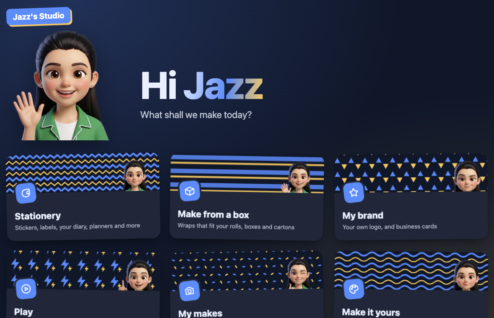
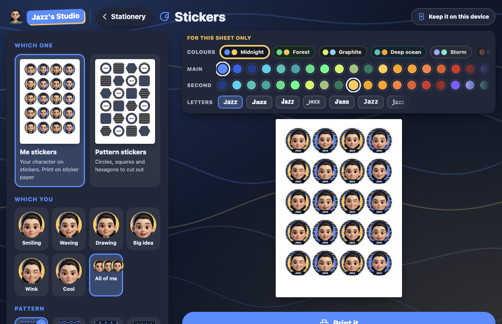
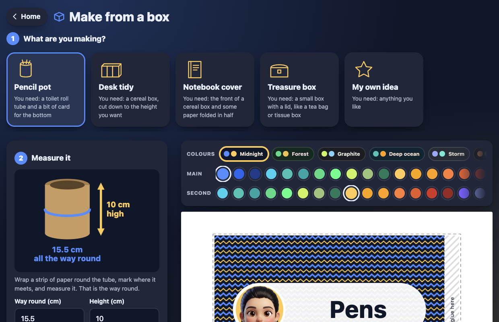
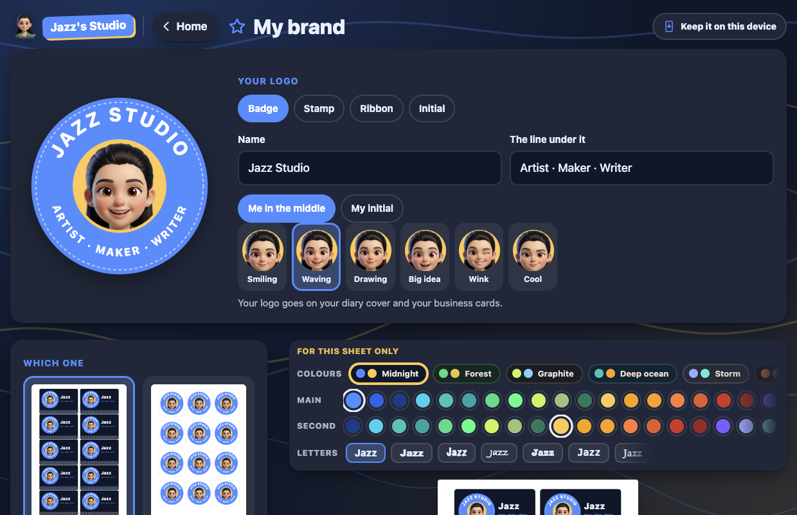
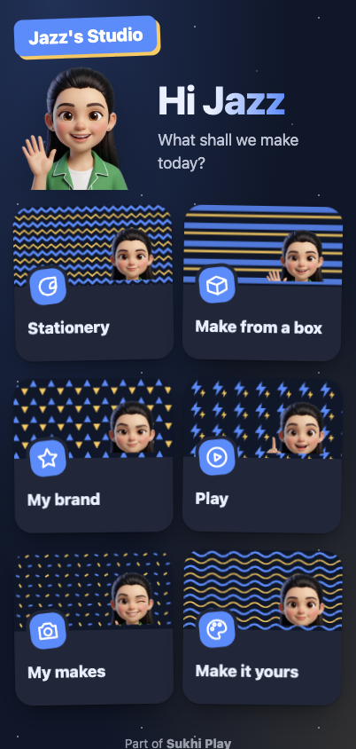

<div align="center">


# Jazz's Studio

**Design it, print it, make it yours.**

**[sukhiplay.com/studio](https://sukhiplay.com/studio/)** &nbsp;&middot;&nbsp;
**[Open the studio](https://sukhiplay.com/playground/studio/)**

[](LICENSE)
[](https://sukhiplay.com/)
[](https://sukhiplay.com/playground/)



</div>

---

A studio for Jazz, who is ten, loves stationery, and turns the recycling into
things. Her brother got [Sukhi Play](https://sukhiplay.com/) and she wanted
something of her own, so this is hers: her character, her colours, her name on
everything, and a printer at the end of it.

Dark by default and nothing girly, because that is what she asked for.

## Try it

| | |
| --- | --- |
| **In a browser** | [sukhiplay.com/playground/studio/](https://sukhiplay.com/playground/studio/) |
| **On a phone or tablet** | Open it, then Add to Home Screen. It opens full screen and keeps working with no signal. |
| **Inside Sukhi Play** | It ships in the download, with no internet needed at all. |

## What she can make

| | |
| --- | --- |
| **Stationery** | Stickers of her character, pattern stickers, name labels, bookmarks, a diary cover and diary pages, a week planner, to-do lists, gift tags, door signs and letter paper |
| **Make from a box** | Measure a toilet roll, a cereal box or a lid, and print a wrap that fits it, with the steps to make a pencil pot, a desk tidy, a notebook cover or a treasure box |
| **My brand** | Her own logo in four styles, business cards and logo stickers. The logo goes on her diary cover and letter paper too |
| **Play** | A poster of her name, secret messages in pigpen with a key for a friend, story sparks for when the diary page is blank, and a doodle pad |
| **My makes** | Photos of everything she made, kept on the device |
| **Make it yours** | Her character, or a family's own (see below), her name, seven letterings, twelve colour sets and any colour besides, her favourite pattern and the background |

The colours are on a strip above the preview in every tool, so a colour is
tried where it shows rather than in another room.

<div align="center">




</div>

## Printing

Every sheet is drawn in millimetres on A4. Print at **actual size** (100%, not
"fit to page"): most sheets carry a line that should measure exactly 5 cm, so
a ruler can check, and a wrap for a toilet roll comes out the right size to go
round one. Nothing is closer than 10 mm to the edge.

## Safe for her

- **Nothing leaves the device.** No accounts, no tracking, no analytics, and
  nothing is fetched: every font is already on the computer, every picture is
  drawn or shipped with the app.
- **Works offline.** Once it has been opened, it keeps working with no
  connection.
- **Her things stay hers.** Photos and doodles are kept in the browser on this
  device, and removing one takes two taps.

## Her character

Six poses of the same girl, drawn from a photo of Jazz: smiling, waving,
drawing, big idea, wink and cool. Each was rendered on flat magenta and cut out
locally with `scripts/cutout.py`, which also takes the magenta light the render
bounces onto her hair back out.

### Your own character

Other children can have their own. In Make it yours, **Add a character** takes
a picture of a character on a plain colour (choose it, drop it, or paste it),
cuts the background out in the browser with `src/cutout.ts`, finds the face,
and keeps it on the device. Once a family adds any, theirs are the character
list. A **For grown-ups** guide inside shows how to make one from a photo with
Google Gemini, using the prompts that made Jazz's.

**The character artwork is not covered by the code's licence.** It is a
likeness of a real child. `src/assets/jazz/`, the icons in `public/`,
`scripts/icon-1024.png` and `media/` are © Mandeep Singh, all rights
reserved, and may not be reused, modified or redistributed.

## Building it

```
npm install
npm run dev      # http://localhost:5178
npm run build    # into dist/
```

Plain TypeScript and Vite, no framework. Inside the Sukhi Play repository,
`node scripts/playground-app.mjs studio` builds it into the download and the
website together.

## Licence

The code is under the [Sukhi Play Personal Use Licence 1.0](LICENSE): free for
individuals and families, never for commercial use. The character artwork is
not; see above.
